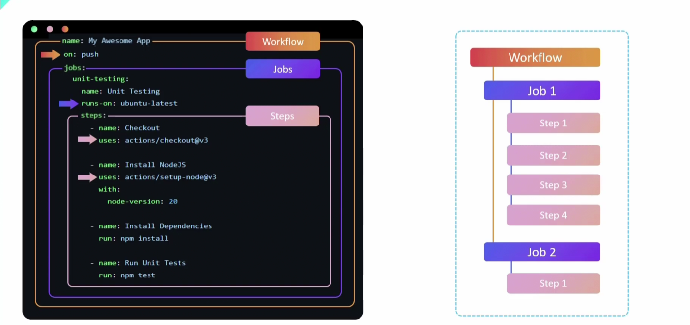

# GitHub-Actions-learn

- Day 01 Learning GitHub Actions
    - Covered CI/CD basic concept.
    - Why to use github actions.

    - Github Action contains three major part. 

        

        1. Workflow - 
                This will run pipeline based on event. 
        2. Jobs - 
                Building block of Actions, will run on hosted or self maintaned runners. 
        3. Steps - 
                This are individual action that make the jobs

- What is actions template ?

        This actions are creates dby people like us. Prebuilt automation template make use of reusable automation logic.